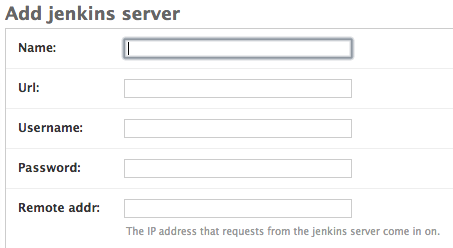
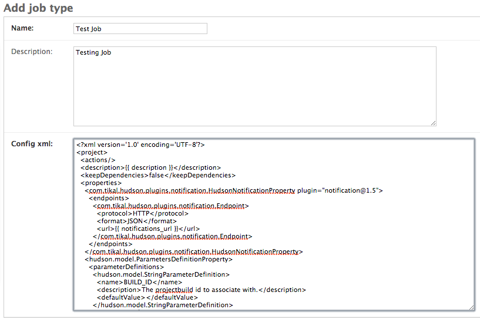
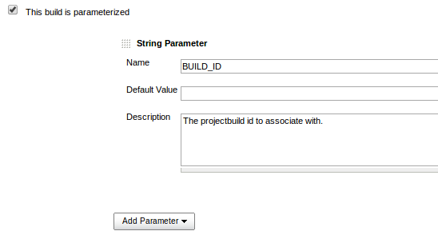

Getting Started
===============

Currently Capomastro requires Python 2.7, because of the dependency on paramiko.

Before we begin you will need database, this is tested with PostgreSQL, and
psycopg2 is in the `requirements.txt`  but you can probably get by with
sqlite, and you'll want rabbitmq installed too.

On Ubuntu you can install these with:

    $ sudo apt-get install postgresql-9.1 libpq-dev rabbitmq-server

You will also need a Jenkins server running on a machine, with the [Notification plugin](https://wiki.jenkins-ci.org/display/JENKINS/Notification+Plugin) installed.

To get Capomastro up and running:

1\. Clone the source from the [Github repository](https://github.com/capomastro/capomastro)

2\. Create a virtualenv in your environment:

        $ mkvirtualenv capomastro

3\. Install the dependencies.

        $ pip install -qr requirements.txt

4\. If you're using PostgreSQL, you'll want to create a database, otherwise you
   can skip this step.

        $ createdb capomastro

5\. Create a `capomastro/local_settings.py` and  and configure the database settings.

        $ cp capomastro/local_settings.py.example capomastro/local_settings.py

    If you need help with the settings, please see the [Django documentation](https://docs.djangoproject.com/en/1.6/ref/settings/#databases)

You will need to set the `NOTIFICATION_HOST` to a valid URL to access your Capomastro instance, Jenkins will callback to this URL to notify the application of build status.

6\. You can now create the database and superuser.

        $ ./manage.py syncdb --migrate

    You will be prompted to create a superuser during this process.

7\. Start celery running.

        $ celery -A capomastro worker -l info

8\. Start gunicorn running.

        $ gunicorn -b 0.0.0.0:8000 capomastro.wsgi:application

9\. Login to the application via the [admin](http://localhost:8000/admin/).

You now have Capomastro up and running, in order to get your first build
dependency created, you will need a working config.xml from a Jenkins job that
you wish to build.

To get a dependency built in a project.

10\. Create a Jenkins Server via the [admin interface](http://localhost:8000/admin/jenkins/jenkinsserver/)

The `REMOTE_ADDR` is used to identify incoming notifications from servers, it should be the IP address that requests coming into the server appear to come from.

11\. Create a Job type via the [admin interface](http://localhost:8000/admin/jenkins/jobtype/)

When creating a Job type you will need to provide the `config.xml` that you wish to
see built in a Jenkins Server.

There are several requirements for this `config.xml` (See [example](example_config.xml))

It requires a notification setup, see this example:

It requires a BUILD_ID string parameter.

The `config.xml` file is templated using the Django templating language, `{{ notifications_url }}` will be replaced using the value from `NOTIFICATION_URL` in the `local_settings.py` file.

12\. Creating a dependency

Dependencies control the building of Jobs, when you create a Dependency, you specify a Job type and a Server to build that job on.

Delegating the builds to a Jenkins Server means that Jenkins will handle building on the slaves associated with that Jenkins server.

Visit [The dependency creation form](http://localhost:8000/dependencies/create/) and enter a name for this dependency.

Parameters can be specified for this dependency, and will be passed to the Jenkins Job on build on every build.

The parameter entry box can be filled in e.g.:

    MYVALUE=testing
    MYOTHERVALUE=othervalue

This will result in two parameters being passed to every build, with the key, value pairs.

Creating a dependency should result in a job being pushed to your chosen Jenkins server, in your Celery screen, you should see the log from this happening.

13\. Creating a project.

Capomastro manages builds of dependencies through a project, when you create a project, you specify the dependencies.

